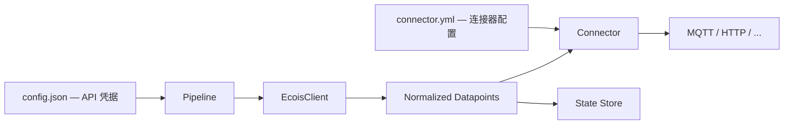

# sensordata-forwarder

E 生态传感器数据转发管道。从 E 生态 OpenAPI 拉取数据，通过**连接器（Connector）**转换并转发到客户平台。

每个数据转发任务都是 case by case 的，因此采用 Connector-only 架构。

## 架构



## 快速开始

```bash
# 安装依赖
bun install

# 创建 API 凭据配置
cp config/config.json.example config/config.json
# 编辑 config.json 填入 appid 和 secret

# 创建连接器配置（以 xkh 为例）
cp xkh.yml.example xkh.yml
# 编辑 xkh.yml 填入 MQTT 信息和站点映射

# 运行
bun start -- --connector xkh --extra-config ./xkh.yml

# watch 模式
bun dev -- --connector xkh --extra-config ./xkh.yml
```

## 目录结构

```text
.
├── connectors/                    # 连接器目录
│   ├── example-connector.ts       # 连接器模板
│   └── xkh-connector.ts          # XKH 平台连接器
├── config/
│   └── config.json.example        # API 凭据模板
├── xkh.yml.example                # XKH 连接器配置模板
├── data/                          # 状态文件（自动生成）
├── src/
│   ├── core/
│   │   ├── config.ts              # 配置加载
│   │   ├── connector-loader.ts    # 连接器加载
│   │   ├── ecois-client.ts        # E 生态 API 客户端
│   │   ├── pipeline.ts            # 主流程
│   │   ├── state.ts               # 状态持久化
│   │   └── types.ts               # 类型定义
│   ├── utils/
│   │   ├── logger.ts
│   │   └── mqtt-helper.ts         # MQTT 连接池
│   └── index.ts
└── test/
```

## 命令行

```
bun start -- --connector <name> [--extra-config <path>]
```

| 参数 | 说明 |
| --- | --- |
| `--connector <name>` | 连接器名称，对应 `connectors/<name>-connector.ts` |
| `--extra-config <path>` | 连接器私有配置文件（YAML） |

## 配置

### config.json — API 凭据

```json
{
  "api": {
    "appid": "your-appid",
    "secret": "your-secret"
  }
}
```

仅需填写 E 生态凭据。其余参数（设备过滤、抓取模式等）均有默认值，按需覆盖即可。完整可选项见 `src/core/config.ts`。

### 连接器配置（YAML）

每个连接器的私有配置（服务器地址、凭据、映射关系等）放在独立的 YAML 文件中，通过 `--extra-config` 传入。YAML 文件已被 `.gitignore` 排除，不会被提交。

## 约定

| 项目 | 约定 |
| --- | --- |
| 连接器导出 | `export default` 工厂函数 `(config?) => Connector` |
| 连接器文件 | `connectors/<name>-connector.ts` |
| State 文件 | `./data/state.json`（固定） |
| 日志级别 | `info`（可通过 `LOG_LEVEL` 环境变量覆盖） |
| 敏感配置 | YAML 文件，gitignored |

## 连接器开发

### 接口

```ts
import type { Connector, ConnectorContext, ConnectorLogger } from "../src/core/types.ts";

export default function createMyConnector(config: unknown): Connector {
  // 解析 config（来自 --extra-config YAML）

  return {
    name: "my-connector",

    async init(logger: ConnectorLogger) {
      // 初始化连接
    },

    async forward({ device, datapoint, logger }: ConnectorContext) {
      // 转换数据并发送
    },

    async close() {
      // 清理连接
    },
  };
}
```

### ConnectorContext

```ts
interface ConnectorContext {
  device: DeviceSummary;          // 设备信息
  datapoint: NormalizedDatapoint; // 标准化数据点
  streamKey: string;
  logger: ConnectorLogger;
}
```

### MQTT 连接池工具

```ts
import { MqttConnectionPool } from "../src/utils/mqtt-helper.ts";

const pool = new MqttConnectionPool(
  { brokerUrl: "mqtt://host:1883", username: "user", password: "pass" },
  logger,
);

const client = await pool.getClient(`clientId_${device.sn}`);
await client.publishAsync(topic, payload, { qos: 0 });
await pool.closeAll();
```

### 开发步骤

1. `cp connectors/example-connector.ts connectors/foo-connector.ts`
2. 创建 `foo.yml`（MQTT/HTTP 连接信息、映射关系等）
3. 实现 `init()` / `forward()` / `close()`
4. `bun start -- --connector foo --extra-config ./foo.yml`
